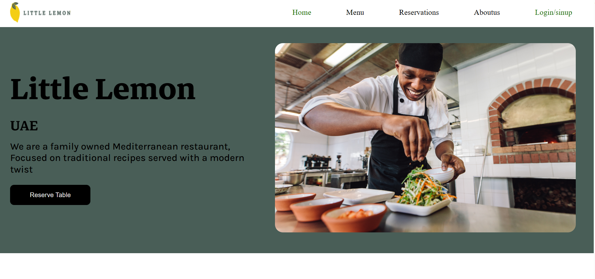
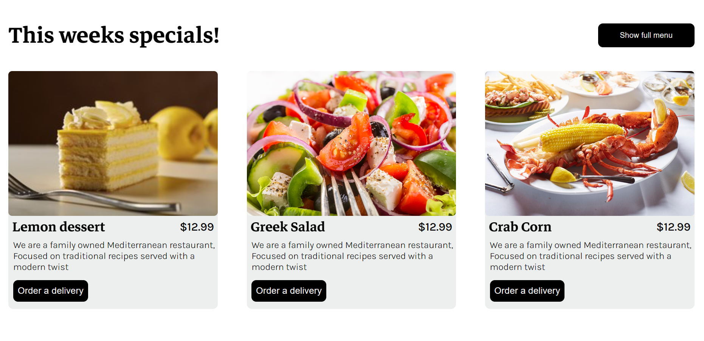
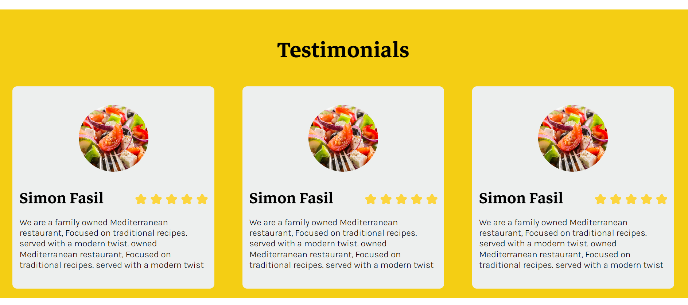
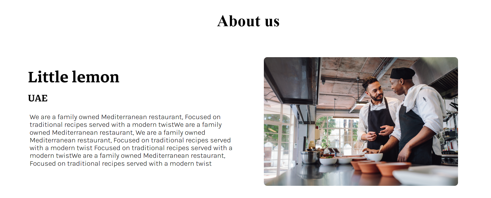
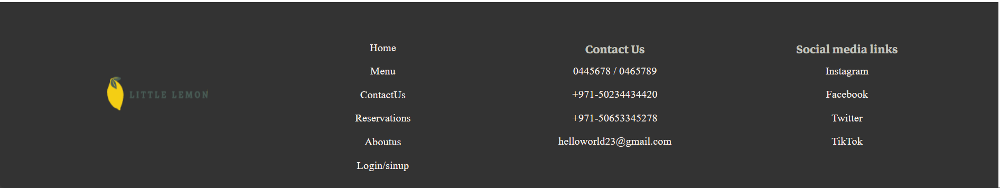
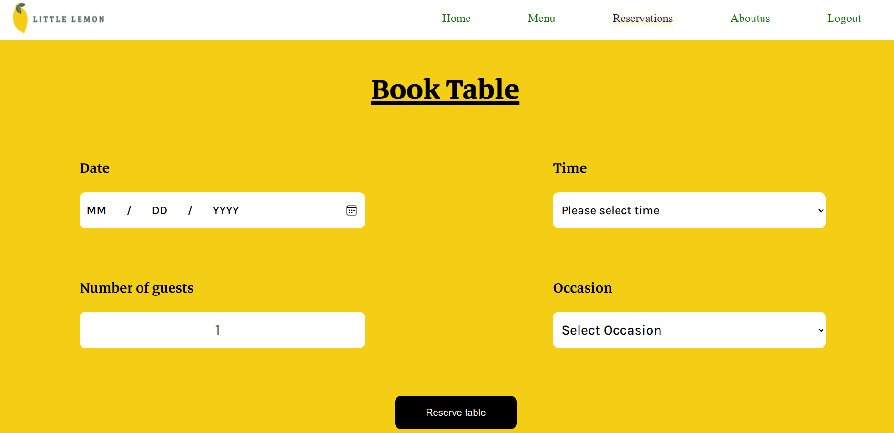

# Littlelemon_Fullstack_App
This repo contains a booking application for a fictional restaurant called Little Lemon. You can clone or download the file.

😁 Please dont forget to rate!!!

> Link to access the site: https://littlelemonui.onrender.com/ hosted on the Render platform free tier .free tier may not be available with time and the site might be down.
> N.B: if you can't access the site download or clone the project and run it locally.

# Here are some of the UI examples:

> landing page layout

>Reservation page UI

